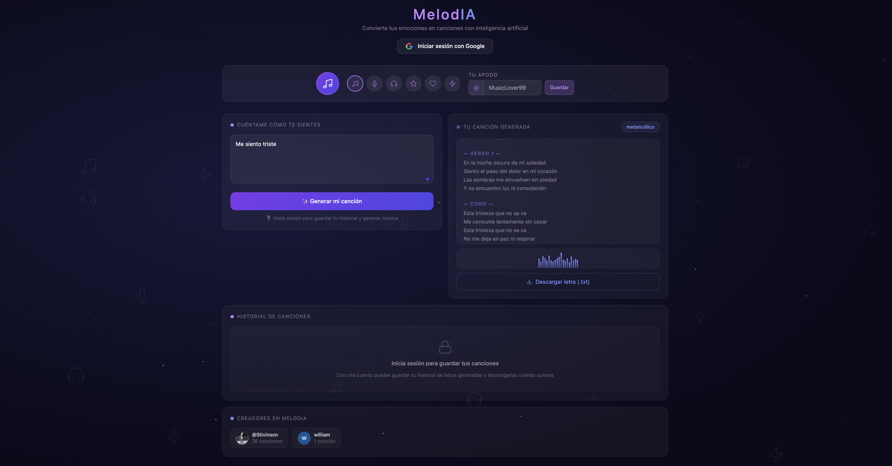
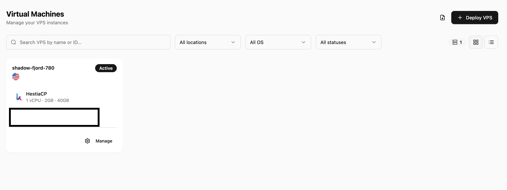

# 🎵 MelodIA

> **MelodIA** convierte tus emociones en canciones originales. Escribe cómo te sientes, la IA analiza tu estado de ánimo, compone una letra única con ritmo y rima, y la muestra con efecto karaoke animado en tiempo real.

---

## 🌐 Demo en vivo

🔗 [https://vps22920.cubepath.net](https://vps22920.cubepath.net)

---

## 📸 Capturas del proyecto

> Vista principal con fondo estrellado animado por mood, selector de avatar, panel de entrada de emociones, karaoke animado, historial de canciones y creadores de la plataforma.

---

## ✨ ¿Qué hace MelodIA?

1. ✍️ **Escribe cómo te sientes** — describe tu estado de ánimo con tus propias palabras
2. 🧠 **La IA analiza tu emoción** — Claude detecta el mood (melancólico, feliz, romántico, etc.)
3. 🎼 **Genera una letra original** — con ritmo, rima y estructura de canción real (Verso, Coro, Puente)
4. 🌈 **El fondo cambia con tu emoción** — partículas y colores animados según el mood detectado
5. 🎤 **Efecto karaoke en tiempo real** — cada línea se ilumina automáticamente
6. 💾 **Descarga tu letra** en formato `.txt`
7. 📚 **Historial personal** — guarda todas tus canciones si inicias sesión con Google

---

# 

## 🛠️ Tecnologías utilizadas

### Frontend
| Tecnología | Uso |
|---|---|
| **Angular 17+** | Framework principal (standalone components) |
| **Tailwind CSS** | Estilos y diseño de la interfaz |
| **TypeScript** | Tipado estático |
| **RxJS BehaviorSubject** | Estado compartido entre componentes |

### Inteligencia Artificial
| Servicio | Uso |
|---|---|
| **Claude Haiku** (Anthropic API) | Análisis de mood + generación de letra con ritmo y rima |

> Claude analiza el texto del usuario, detecta la emoción y genera una letra completa con estructura musical (Verso 1, Coro, Verso 2, Puente, Coro Final), ritmo de 8-12 sílabas por línea y rima consonante.

### Backend
| Tecnología | Uso |
|---|---|
| **PHP 8.3** | API proxy + gestión de BD |
| **MySQL** | Almacenamiento de usuarios e historial |
| **HestiaCP** | Panel de administración del servidor |

---

## 🏗️ ¿Cómo funciona?

El usuario escribe cómo se siente y Angular envía ese texto directamente a la API de Claude. Claude analiza la emoción, detecta el mood y genera una letra completa en formato JSON. Angular la renderiza con efecto karaoke, visualizador de ondas y fondo animado. Si el usuario tiene sesión iniciada con Google, la letra se guarda en MySQL a través del proxy PHP.

---

## 🚀 Infraestructura — CubePath

MelodIA está completamente desplegada en **[CubePath](https://midu.link/cubepath)**. El proceso fue el siguiente:

**1. Creación del VPS** — Desde el panel de CubePath se creó el VPS, que viene con HestiaCP preinstalado. Esto permitió configurar el servidor web, dominio SSL y base de datos desde una interfaz gráfica sin configuración manual compleja.

**2. SSL automático** — HestiaCP generó el certificado Let's Encrypt automáticamente, habilitando HTTPS en el dominio del VPS — requisito para que el navegador permita peticiones a la API de Claude.

**3. Base de datos MySQL** — Se creó una base de datos en HestiaCP con dos tablas: `usuarios` para guardar el perfil de cada persona que inicia sesión con Google, y `historial` para registrar cada canción generada con su mood, letra y fecha. Esto permite que cada usuario pueda ver y descargar sus canciones anteriores desde cualquier dispositivo.

**4. Build y deploy** — Se generó el build de producción con `ng build`, se subió a GitHub y desde el servidor se clonó el repositorio, se instalaron dependencias con Node.js y se copiaron los archivos al directorio público de HestiaCP.

**5. Google OAuth2** — Se configuró el flujo implicit token. Google devuelve el token en el hash de la URL, Angular extrae el perfil y lo guarda en MySQL y `localStorage`.

---

## 🎨 Características de UI/UX

- **Fondo animado por mood** — colores y partículas flotantes cambian según la emoción detectada
- **Efecto karaoke** — cada línea se ilumina automáticamente cada 2 segundos
- **Visualizador de ondas** — 20 barras animadas del color del mood
- **Etiquetas de sección** — Verso 1, Coro, Verso 2, Puente, Coro Final
- **Historial con creadores** — sección pública con foto, apodo y canciones de cada usuario
- **Login con Google** — perfil con avatar e icono personalizable

---

## 👥 Equipo

| Integrante | GitHub |
|---|---|
| Stivinson Correa Maturana | [@Stivinsonweb](https://github.com/Stivinsonweb) |
| Willy | [@willyrr19](https://github.com/willyrr19) |

---

  Hecho con ❤️ para el <strong>Hackathon CubePath 2026</strong> — desplegado en <strong>CubePath</strong>

